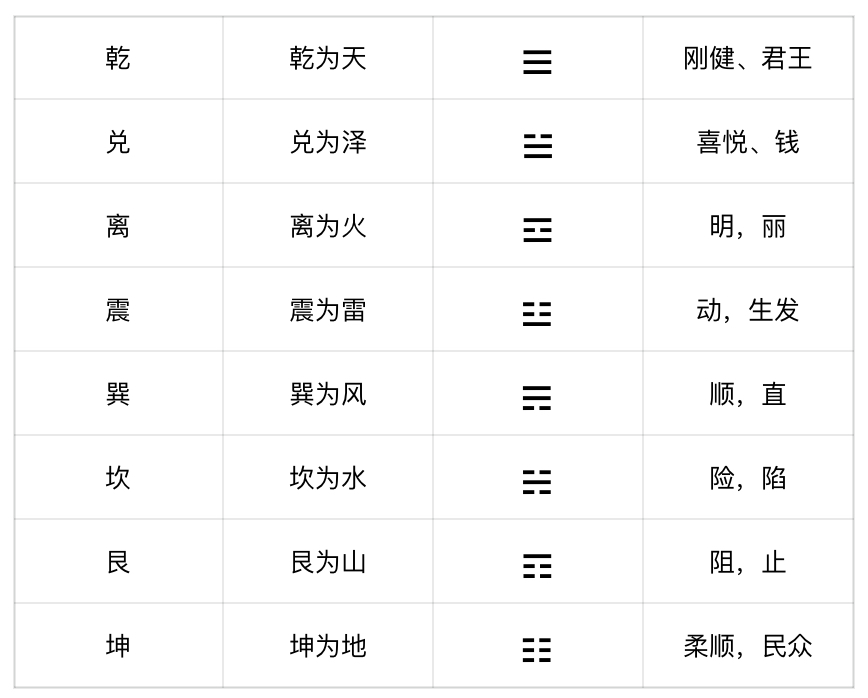

# 视频解说
## 玄学系统的底层逻辑
玄学系统的底层逻辑到底是什么？很多朋友在自学易经时候，总会觉得很抽象、很难理解要背的东西特别多，流派也特别多，也没有清晰的逻辑主线，所以只能死记硬背。那么为了解决以上的问题，我们来系统地梳理一下玄学的底层逻辑。

其实玄学系统中的任何技法，都离不开，阴阳、五行、八卦、天干地支这四个部分，这四个部分是整个玄学系统的底层模块。我们从医、命、卜三个角度来举例说明：

看完上面的例子，我们来了一个学术总结:
- 阴阳：是宇宙的“第一动力”与“根本法则”，它相当于计算机世界的0和1，物理学的基本粒子，是万物的起点。
- 五行：是宇宙的“动态模型”与“关系网络”，它相当于物理模型中的引力和场。
- 八卦：是宇宙的“基本分类”与“象征符号”，它相当于化学中的元素周期表，用有限的基本元素（卦）来组合表示无限的事物。
- 天干地支：是宇宙的“时空坐标”与“运算符号”，它相当于数学中的变量和坐标系（如X, Y, Z轴），为推算提供了基础和工具。

上面这段话非常的不接地气，大家可以忽略它，下面我将以大家能听懂的方式来解释这个四个底层概念。

既然要研究底层，我们就要从宇宙的起源说起。现代科学认为，宇宙起源于大爆炸，而我们要讲的故事比宇宙爆炸还要久远...

## 阴阳五行
### 阴阳
至少150亿年以前，天地处于一片虚无，这个状态被称之为混沌又叫做无极。然而此时的虚无并非真正的无，而是充斥着各种能量，道家哲学称这种能量为炁。这个能量不断的变化，就由无极产生了太极。太极状态就是宇宙爆炸的临界点，它是一切物质和能量的本源。

现代科学谈论到宇宙大爆炸之后，就直接进入了物质世界。比如宇宙粒子、星云、星系等各种天体，但是这种演化过程仅仅是基于物质层面的结果，无法完整的解释从无到有的过程。而道家哲学给出了从能量层面到物质层面完整的转化过程。（我们一起来看看）

当无极进入太极之后，首先就分出了阴阳。

那什么是阴阳？我们可以从三个层面理解它：
首先他是一种对立的哲学概念，我们举个例子比如：日夜、寒热、长短，它们相互制约、又相互约束。其次，它们还相互依存、互为根本。比如：没有白天也就没有黑夜，没有寒冷也就没有炎热，没有长也就没有短。再次，阴阳之间存在消长的关系，但这消长并不一定是此消彼长，也可能是同消同长。比如：昼长夜短就是此消彼长；再比如：手心在长大，手背也随着长大，这就是同消同长。最后，阴阳之间可能会相互转化，比如：日夜更替，乐极生悲，苦尽甘来。

总之：当你看日升月落，阴晴圆缺，寒来暑往，草木枯荣时，你就能体会这就是阴阳，它无形却藏于万象，无论生死祸福，富贵贫贱，还是善恶得失，悲欢离合，这世间所有的跌宕与安然、炽热与清寒，都不过是天道阴阳相契相生的流转罢了。
### 五行
无极生太极，太极生阴阳，阴阳又在阴阳的变化下分出了四象：少阳、太阳、少阴、太阴。这四象直接暗示了万物生灭的过程：生（少阳）、长（太阳）、收（少阴）、藏（太阴）。促使生、长、收、藏四象之间变化的过程就是五行，它既是五种不同的能量，同时又是蕴含五种能量的状态。

在四象更替的过程中，有一种能量，不断的上升，这种能量称之为火；一种能量是不断下降，这种能量称之为水；一种能量是由内向外不断的生发，这种能量被称之为木；一种能量是由外向内不断的收敛，这种能量称之为金，还有一种能量是处于居中稳定的状态，这种能量被称之为土。

这五种能量又存在两种关系，相生相克。木火土金水，这个顺序是相生关系，但这个相生不是我们化学中的生成关系，而是一种助力，有利于，延续的关系。比如：水生木，是水利于木，木生火，是木利于火。同理相克，也不一定代表相杀，而是阻力，不利于，取代的关系。比如：木土水火金，这里土克水，就代表是阻挡。

说到这里又不得不提汉字文化，汉字是带有五行属性的。比如：热煎煮蒸熏，它们的五行是火。一般有四点底的汉字，五行可能是火，代表着能量。所以再回头看看，宇宙之初的《炁》，我们就能理解为它是虚无状态下的能量。

我们再来看几个汉字五行生克的案例。
你看东土大唐的唐字，五行属土，为什么属土呢？你看庙府库庭庄，都是跟建筑有关，所以五行为土。你再看宋朝宋字，说文解字为屋舍下方的草木，五行为木，巧合在木克土，所以宋朝取代了唐朝。元朝的国号是元，五行属金，金克木，所以元朝取代了宋朝。明，日月为明，五行为火，火克金，所以明朝取代了元朝。清朝的清，五行为水，水克火，所以清朝取代了明朝。

有朋友问这些难道都是巧合吗？其实不是，在古人眼里，定国号就是讲究五行生克的，但是巧就巧在，中字的五行确实也属土，而土恰恰又克水。

讲完五行生克，我们剩下最后一个话题，物质的五行属性可能会变。
我们举个例子吧，比如水，无论在气态、液态、还是固态下的化学分子式都是H₂O，但是三态下五行属性完全不一样。常态下的水五行就是水，但是当水变成冰的时候五行就变成了金。

为什么是金呢？古人观察到冬天山上积雪融化。从山尖上垂下来一个个冰锥子，冰锥子它锋利，坚硬、寒凉、有点像兵器矛（可刺穿盾的那个矛），所以五行属金。

那水在气态时候五行又是什么呢? 属木。水在气态的卦象为巽卦（这个我们在后面讲八卦时候会细说），巽为风，可以理解外为流动的气，形成了风，风可使树木摇动，所以五行属木。

五行变化的一个典型的应用就在中药里面，比如，生姜和干姜，虽然都是姜，但五行属性却不一样。生姜五行以木为主，干姜五行以火为主。因为 
- 生姜：解表散寒，温中止呕，助肝木疏泄，开肺气。
- 干姜：温中散寒，回阳通脉，助心火温运，生脾土。
这里可以看到，肝属木，心属火，生姜属木，干姜属火。

到这里，五行相关的内容讲完了，所以《道德经》有云：
道生一（两仪：$2^1=2$），一生二（四象：$2^2=4$），二生三（八卦：$2^3=8$），三生万物。 

说得就是，太极生两仪，两仪生四象，四象生八卦，八卦之后才进入宇宙大爆炸，于是便有了宇宙粒子、星云、星系等各种天体。 在数亿年的时间内，先后诞生了紫微为首的北斗星系、天府为首的南斗星系，以及太阳、太阴为首的中天星系，从而衍生出了《十八飞星》和《紫微斗数》，这也我们后面要讲得重要技法之一。

## 八卦
无极生太极，太极生两仪，两仪生四象，四象生八卦。卦象在紫微斗数几乎没有用到，紫微斗数用到的几乎都是星象。但是卦象在占卜预测中应用广泛，比如《六爻》、《梅花易数》等。我们今天深入讲解一下八卦。八卦由四象的阴阳变换而成。（图例阴阳变换图）

首先，我们来看一张先天八卦图，
然后，我解释一下这张先天八卦图上的这些符号都有哪些意义。
最先看到的是这个圆盘，盘中面积最大的区域一黑一白就代表阴阳，这就是所谓的太极生两仪（阴阳）。圆盘周围这一圈的符号就是先天八卦，分别是：乾、兑、离、震、巽、坎、艮、坤。
### 卦象
我们以古人的视角从象角度来解释这八个卦：

天，万里无云的天，是连续的、光滑的，所以三个阳爻代表天。
地，大地表面坑坑洼洼的，特别是农田，一块一块的，所以三个阴爻就代地。
泽，为湖泊的意思，风平浪静的湖泊，如同一面镜子倒映着天，兑上面的阴爻代表湖泊的岸边，下面两个阳爻就是天的倒影。
火，是中间温度低，四周温度高，所以离火，就是中间为阴爻，上下为阳爻。
雷，当古人听到打雷的时候，会感到大地在震动，所以大地最深处的阴爻变成了阳爻，就产生了震动。
风，天下流动的空气为风，所以上面两个阳爻代表天，最下面的阴爻就代表流动的空气，所以巽为风。
水，在古人眼里就是大地中间河流，两个岸边为阴爻，中间平滑的河水为阳爻，所以坎为水。
山，就是隆起的大地，山顶之上就是天，所以，最上面的阳爻就代表天，下面的阴爻代表隆起的大地。

这种理解卦的方式叫做读象，读象是学习易经非常重要的技能，包括后面学习64卦，通过读象的方式去理解就会容易很多，记住不要死记硬背，后面我会有专门的篇章从象的角度来解读易经64卦。
### 卦序/先天数
上面我所讲的只是从象的角度去理解卦，除此以外，还要知道卦序和卦数。在刚才我解释卦象的时候顺序是，乾》坤》兑》离》震》巽》坎》艮，但这并不是真正的卦序，那我为什么还要按照这个顺序来解释呢，是因为乾坤生万物，乾为父，坤为母，剩余的六卦皆为六子。

那真正的卦序是什么呢？我们再来看这张表:

我解释一下为什么是这个顺序，因为先天八卦图描述了从全阳到全阴的转换过程，全阳为始，全阴为终。按照这个过程往下走，乾》兑》离》震，卦序对应1234。
有人就问了，按照先天八卦图到了震以后，下一个不应该是坤吗，怎么是巽呢？注意，中间这根类似于S的曲线，叫做曲成线，它的哲学意义就是“事以曲成”，这根线代表着，阳开始转阴了，所以这根线以上的部分都是阳卦，为什么都是阳卦，因为每个卦，最内层的爻是阳爻。通过曲成线的引导，震卦下一个卦就是巽卦，最内层的爻首次成为阴爻，所以进入阴卦群。巽之后就是坎》艮》坤，对应的卦序就是5678。
### 二进制
截止到这里，我们从象和逻辑的角度把先天八卦解释完了，但我想说，更为神奇的是，计算机科学底层的二进制，可以更完美的解释先天八卦，让我们一起来推导一下。

首先卦是有阴爻、阳爻组成的；同理计算机的世界是由0,1组成的，你把阳爻看成1，阴爻看成0，然后再回头看这先天八卦表：

上面的推导过程很多人可能不理解计算机二进制，这并不重要，重要的是，你只要知道计算机的发明就是模拟了易经的先天八卦，才有了现在丰富多彩的数字网络世界。

### 卦序的隐喻

先天八卦还有一些隐喻，如果你顺着卦序走，便是顺流而下，因为由天到地，卦象是天地否，如果逆着卦序走，便是从地到天，卦象为地天泰。
以卦序逆流而上为例，举一个从地到天的（泰）例子，比方说我从零（坤卦000）开始一个项目，一开始就会遇到很多阻力（山为艮，为阻力），停滞不前。
阻力重重，继续前行，也可能会遇到进退两难得瓶颈（坎为限，为险，有如脖子被卡，所以叫瓶颈），此时最容易放弃。
如果，继续一直前行（巽为直，顺），便会见到曙光（震为生发，也代表0到1的突破）
继续逆行，便得离卦（离为火为明），项目开始明朗。
继续逆行，便得兑卦（兑为悦，为喜悦），兑卦也有钱（￥羊）的象。
继续逆行，你可以上天了，所以人家都问你咋不上天呢？就是这么来的。
总结一下，一个项目从零开始（☷），就会阻力重重（☶），过一阶段会进退两难，想要放弃（☵），坚持下去（☴），就会初见曙光（☳），继续行动，就会拨云见日（☲），此时会喜悦因为见着钱了（☱￥），继续前行，就是朗朗乾坤。

反过来，刚好相反，因为卦象是天地否。
### 五行
以上我们讲了八卦的概念，以及其中的象义，下面我们介绍一下八卦的五行：

好，我们来解释一下，为什么是这个五行对应关系，记住不用死记硬背，理解为主。
乾为什么为金呢？ 乾代表刚健，代表天，与金的属性一致。
兑为什么也为金呢？ 有人说兑不是泽，泽不应该是水吗？ 注意我们在解释卦象的时候说的是湖水如镜，倒映着天，所以应该映射到【镜子】，古代镜子都是金属，所以五行为金。另外，从卦象上来看，兑卦，上阴为小，下两阳为大，上小下大，是不是代表汉字【尖】，有针、锥之象，所以五行属金。
离为火，五行为火。
震为木，震为大地内部的震动，代表大地内部的生机，比如种子发芽，代表生发之象，所以五行为木。
巽为风，风为木。风本无形，见木为动，所以木动可知风，巽的五行为木。
坎为水，五行为水。
艮为山，山石为土，五行属土。
坤为地，五行为土。
这就是八卦所对应的五行，下面我们将，数字、卦、象、五行结合起来举个例子。
### 后天八卦
先天八卦出来了，发现没法应用。理论没法投入实践啊，所以，周文王被囚，在牢里推衍后天八卦，我猜测他当时从读象的角度，来推演的，我们一起来看

春天生机盎然，为震；日升，为生，为东方。
夏天最热，为火；日中，为火，为南方。
秋收时候最喜悦，为兑；日落，为降，为西方。
冬天最冷，为水；日藏，为水，为北方。
第一步，定四正
第二步，五行过渡定八方
第三步，得到后天八卦
第四步，映射上洛书，就的得到了八卦的后天数字，

后天数字主要在《奇门遁甲》和《风水》中，先天数字主要在《梅花易数》中应用，怎么用我们后面会讲。

至此，我们把八卦介绍完了，在后面我们讲《梅花易数》的时候再详细介绍卦的应用。下一节，我们先讲天干地支。